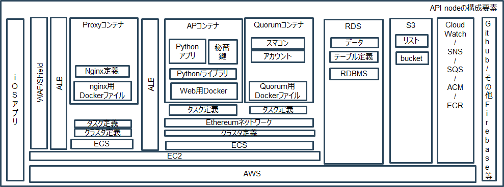
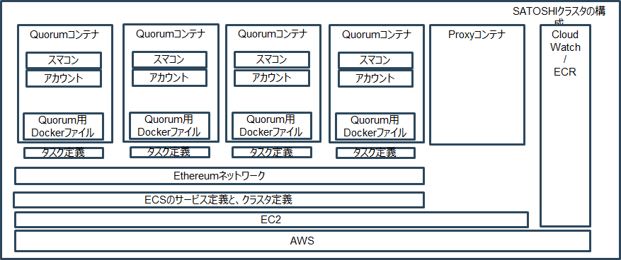
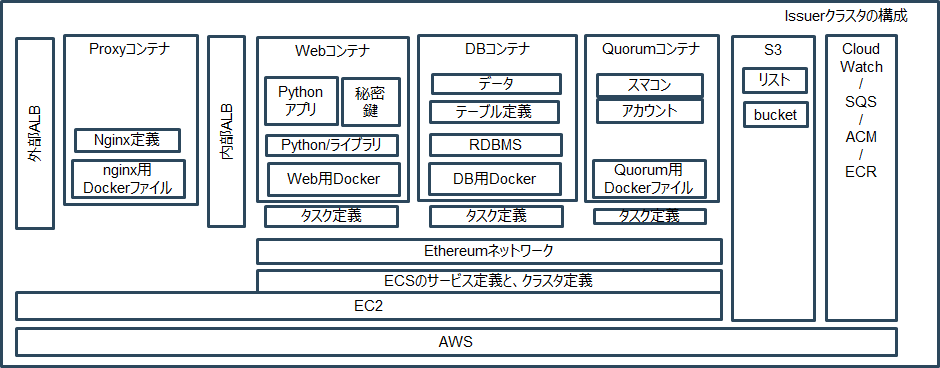
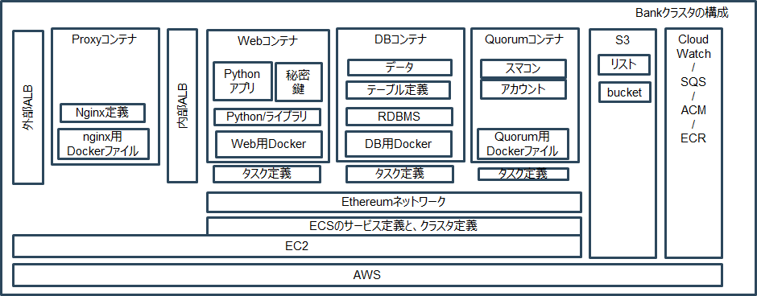

# ibetインフラ構成
## 1. 【全体構成】  

- プロダクション、ステージング用２種類のAWSアカウントが存在する。  
- プロダクション用のAWSアカウント上には、プロダクション環境のみ存在する。  
- ステージング用のAWSアカウントには、ステージング環境、開発環境が存在する。  
- 本来は各社ごとにAWSアカウントを分ける方式(現在RelicはNVC用のAWSアカウント配下に存在)  
- セキュリティ確保のため、各社ごとにVPCを分離。  
- 今回は各環境毎に、NVC用VPCと、コミュニティ用VPCの２種類を用意している。
- 開発環境はアプリケーションの開発環境。1EC2上でDocker Composeを使って起動している。  
- ステージング環境はお客様受け入れ＋NVCの営業用の環境。お客様が自由に試用が可能。  
- プロダクション環境はステージングで受け入れが完了したアプリケーションを可動させる環境。


### 1.1. node-api クラスタ



- iOSアプリ(Wallet)から接続を受け付けるためのクラスタ    
- WAF/Shield、外部ALB、Nginx Proxy、内部ALB、APコンテナ、RDS、SQS、SNS、S3、FireBaseを組み合わせて構成される    


#### 1.1.1 WAF/Shield
- 外部からの不正侵入を抑止するために設置    
- 日本国外からのIPアドレスからのアクセス抑止、単位時間あたりの同一IPからの連続アクセス抑止、SQLインジェクション抑止フィルタを実装    
- 外部ALBにアドインしている    


#### 1.1.2 外部ALB
- nginxを冗長構成するため、かつ、HTTPS→HTTPへ復号化を実施するためにPlublicネットワーク上に設置    
- ドメインはRoute53に格納したNVCのドメイン(api.ibet.jp)を利用  
- 証明書はACMにて作成したAmazon作成の証明書を適用    
- Port443でListenしたものを後ろのnginx Proxyの80番ポートにフォワーディング 
- 背後のnginx proxyが全滅して処理を返せない場合、503エラーとステータスコード999を返却(要確認) 
- アクセスログはS3上に格納している  


#### 1.1.3 nginx Proxy
- DMZに配置し、basic認証機能を搭載することでアクセス制御を実装    
- ECSクラスタ上で可動する  
- AWSのALBが定期的にIPアドレスが変わるため、定期的にキャッシュしたDNSを再読込する機能を実装している  
- ログはCloudwatch logsに出力。    


#### 1.1.4 内部ALB
- APコンテナ、Quorumコンテナを冗長化するために、Privateネットワーク上に設置    
- Port80でListenしたものを後ろのAPコンテナの5000番ポートにフォワーディング 
- Port80でListenしたものを後ろのQuorumコンテナの8443番ポートにフォワーディング 
- ログはCloudwatch logsに出力。    


#### 1.1.5 APコンテナ
- iOSアプリから受け付けるWebAPIと、RDB/Quorumをポーリングして通知を投げるNotificationと、もう一つの３つのコンテナから成り立つ  
- Privateネットワーク上に設置している    
- 基本的にサーバチームが実装、テストしたものをECR経由でコンテナごとリリースする 
- コンテナ部分はUbuntuを利用しており、必要最小限度のライブラリのみ搭載されている。 
- アプリが必要とする定義はタスク定義の環境変数に設定されており、タスク定義を切り替えるだけで各環境で可動する。 
- iOS用のPush通知にApple notification serviceを、Android用のPush通知にFirebaseとSNSを経由して接続をしている。 
- Bankとの連携にSQSを利用している。 
- キャシュ情報やリスティング情報、実行許可コントラクト情報などをRDSに格納。
- アクセス可能な会社のリスト情報などをS3上のWhitelistに格納  
- ログはCloudwatch logsに出力。    


#### 1.1.6 Quorumコンテナ
- 議決権を持たないGeneralノードを配置している  
- 冗長構成をとっており、２つのQuorumコンテナから成り立つ。Act-Act構成だが、切り替えはALBのTargetを明示的に切り替える必要がある。  
- HA構成とせず、手動での切り替えとした理由はQuorumの同期タイミングを考慮したため。１秒以内に切り替えが発生した場合、同期が取られていない情報が見える可能性があるため、自動での切り替えではなく、手動での切り替えとするように設計している。
- Privateネットワーク上に設置している    
- メモリリークが発生していたため、メモリリーク対策を行ったQuorumを格納 
- コンテナ部分はUbuntuを利用しており、必要最小限度のライブラリのみ搭載されている。 
- Quorumが必要とするアドレス情報はタスク定義の環境変数に設定されており、タスク定義を切り替えるだけで各環境で可動する。 
- ログはCloudwatch logsに出力。    


#### 1.1.7 Postgres RDS
- walletからのアクセス要件(24時間365日アクセス)を考慮し、高い可用性を確保するため、RDSを採用。  
- APEC2 上から psqlにてアクセスを行う。  
- ログはCloudwatch logsに出力。    


#### 1.1.8 S3
- アクセス許可を与えられた会社情報及び、エージェントアドレス情報が格納されているリストがある。  


#### 1.1.9 運用
- コンテナ上のCronを使って、定期的にリブートを実施している。  
- バックアップはRDSはマネージドのため不要、アプリケーションはECR上に格納、タスク定義はGithubに格納、Quorumは自動同期のため不要。  
- 監視はディスク、メモリ、CPU等必要最小限の監視のみ実施。  
- リリースはJenkinsにて実装  


### 1.2. satoshi



- コミュニティが利用するValicatorを可動させるためのクラスタ    
- ECS上でValidatorとして設定されたQuorumコンテナが4つ稼働している    
  
  
#### 1.2.1 Quorumコンテナ
- Privateネットワーク上に配置    
- ECSクラスタ上で可動する  
- ValidatorとしてBuildされたQuorumコンテナに、Istanbul toolsで発行したキーを付与している  
- ホストEC2上の/home/ubuntu/quorum_data/v[1-4]配下をECSのコンテナからマウントして利用している  
- static-nodes.json,genesis.jsonを配置  
- ログはCloudwatch logsに出力。    


#### 1.2.2 運用
- バックアップはタスク定義はGithubに格納、Quorumは自動同期のため不要。  
- 監視はディスク、メモリ、CPU等必要最小限の監視のみ実施。  
- リリースはJenkinsにて実装  
  
  
  
### 1.3. Issuer クラスタ



- PCブラウザ(発行体の端末)から接続を受け付けるためのクラスタ    
- 外部ALB、Nginx Proxy、内部ALB、APコンテナ、RDS、SQS、SNS、S3、FireBaseを組み合わせて構成される    


#### 1.3.1 WAF/Shield
- 発行体クラスタではWAF/Shiledは利用していない。WANから許可されたユーザのみアクセスを行うため、不要  


#### 1.3.2 外部ALB
- nginxを冗長構成するためにPlublicネットワーク上に設置    
- ドメインはAWSがデフォルトで割り当てる名前を利用  
- Port80でListenしたものを後ろのnginx Proxyの80番ポートにフォワーディング 
- アクセスログはS3上に格納している  


#### 1.3.3 nginx Proxy
- Publicネットワークに配置し、basic認証機能を搭載することでアクセス制御を実装    
- ECSクラスタ上で可動する  
- ログはCloudwatch logsに出力。    


#### 1.3.4 内部ALB
- APコンテナ、Quorumコンテナを冗長化するために、Privateネットワーク上に設置    
- Port80でListenしたものを後ろのAPコンテナの5000番ポートにフォワーディング 
- Port80でListenしたものを後ろのQuorumコンテナの8443番ポートにフォワーディング 
- ログはCloudwatch logsに出力。    


#### 1.3.5 APコンテナ
- PCから受け付けるWebAPIをコンテナにて提供している  
- Privateネットワーク上に設置している    
- 基本的にサーバチームが実装、テストしたものをECR経由でコンテナごとリリースする 
- コンテナ部分はUbuntuを利用しており、必要最小限度のライブラリのみ搭載されている。 
- アプリが必要とする定義はタスク定義の環境変数に設定されており、タスク定義を切り替えるだけで各環境で可動する。 
- キャシュ情報やリスティング情報、実行許可コントラクト情報などをRDSに格納。
- 秘密鍵を格納しており、ノード構築時に秘密鍵の作成を行う必要がある    
- ログはCloudwatch logsに出力。    


#### 1.3.6 Quorumコンテナ
- 議決権を持たないGeneralノードを配置している  
- 冗長構成の要件はないため、冗長構成になっていない。ただし、ALBを間に挟んでいるため、要件発生時に冗長構成に変更することは可能  
- Privateネットワーク上に設置している    
- メモリリークが発生していたため、メモリリーク対策を行ったQuorumを格納 
- コンテナ部分はUbuntuを利用しており、必要最小限度のライブラリのみ搭載されている。 
- Quorumが必要とするアドレス情報はタスク定義の環境変数に設定されており、タスク定義を切り替えるだけで各環境で可動する。 
- ログはCloudwatch logsに出力。    


#### 1.3.7 Postgres コンテナ
- 高可用性は不要、かつ、OSSで将来的に提供することを考え、DBはコンテナにて実装  
- APEC2 上から psqlにてアクセスを行う。  
- ログはCloudwatch logsに出力。    


#### 1.3.8 S3
- アクセス許可を与えられた会社情報及び、エージェントアドレス情報が格納されているリストがある。  


#### 1.3.9 運用
- バックアップは必要だが未実装、アプリケーションはECR上に格納、タスク定義はGithubに格納、Quorumは自動同期のため不要。  
- 監視はディスク、メモリ、CPU等必要最小限の監視のみ実施。  
- リリースはJenkinsにて実装  


### 1.4. bank クラスタ



- PCから接続を受け付ける決済代行業者向けのためのクラスタ    
- 外部ALB、Nginx Proxy、内部ALB、APコンテナ、RDS、SQS、SNS、S3、FireBaseを組み合わせて構成される    


#### 1.4.1 WAF/Shield
- BANKクラスタではWAFは利用していない。WAN経由のみのアクセスのため

#### 1.4.2 外部ALB
- nginxを冗長構成するためlublicネットワーク上に設置    
- ドメインはAWSがデフォルトで提供しているものを利用  
- Port80でListenしたものを後ろのnginx Proxyの80番ポートにフォワーディング 
- アクセスログはS3上に格納している  


#### 1.4.3 nginx Proxy
- Publicネットワークに配置し、basic認証機能を搭載することでアクセス制御を実装    
- ECSは利用せず、EC2上でDockerを起動している。
- ログはCloudwatch logsに出力。    


#### 1.4.4 内部ALB
- APコンテナ、Quorumコンテナを冗長化するために、Privateネットワーク上に設置    
- Port80でListenしたものを後ろのAPコンテナの5000番ポートにフォワーディング 
- Port80でListenしたものを後ろのQuorumコンテナの8443番ポートにフォワーディング 
- ログはCloudwatch logsに出力。    


#### 1.4.5 APコンテナ
- PCから処理を受け付けるBANK用アプリコンテナから成り立つ  
- Privateネットワーク上に設置している    
- 基本的にサーバチームが実装、テストしたものをECR経由でコンテナごとリリースする 
- コンテナ部分はUbuntuを利用しており、必要最小限度のライブラリのみ搭載されている。 
- アプリが必要とする定義はタスク定義の環境変数に設定されており、タスク定義を切り替えるだけで各環境で可動する。 
- Nodeとのメッセージ連携にSQSを利用している。 
- キャシュ情報やリスティング情報、実行許可コントラクト情報などをDBに格納。
- アクセス可能な会社のリスト情報などをS3上のWhitelistに格納  
- ログはCloudwatch logsに出力。    


#### 1.4.6 Quorumコンテナ
- 議決権を持たないGeneralノードを配置している  
- 冗長構成無し  
- Privateネットワーク上に設置している    
- メモリリークが発生していたため、メモリリーク対策を行ったQuorumを格納 
- コンテナ部分はUbuntuを利用しており、必要最小限度のライブラリのみ搭載されている。 
- Quorumが必要とするアドレス情報はタスク定義の環境変数に設定されており、タスク定義を切り替えるだけで各環境で可動する。 
- ログはCloudwatch logsに出力。    


#### 1.4.7 Postgres コンテナ
- 高い可用性は不要なため、DBはコンテナにて提供している  
- APEC2 上から psqlにてアクセスを行う。  
- ログはCloudwatch logsに出力。    


#### 1.4.8 S3
- アクセス許可を与えられた会社情報及び、エージェントアドレス情報が格納されているリストがある。  


#### 1.4.9 運用
- バックアップは必要だが未実装、アプリケーションはECR上に格納、タスク定義はGithubに格納、Quorumは自動同期のため不要。  
- 監視はディスク、メモリ、CPU等必要最小限の監視のみ実施。  
- リリースはJenkinsにて実装  


## 2. 【運用】  
運用に必要な情報を記載
### 2.1. アクセス方式  
システムへのアクセス方式を記載する  
  
  
### 2.1.1. HTTP(s)アクセス  
API Node、Bank、Issuerには、HTTP(s)リクエスト経由でアクセス可能。
### 2.1.1.1. API Nodeへのアクセス  
インターネット経由にてアクセス可能  
所定のURLにブラウザにてアクセス後、Basic認証にて認証を行うことでアクセス可能となる  
URLはコンフルエンス上の環境情報を参照   
  
### 2.1.1.2. SATOSHIへのアクセス  
SATOSHIへはHTTP経由でのアクセスは不可  


### 2.1.1.3. Issuerへのアクセス  
NRI Proxy及び、NVCからのみアクセス可能  
所定のURLにブラウザにてアクセス後、Basic認証にて認証を行うことでアクセス可能となる  
URLはコンフルエンス上の環境情報を参照   

### 2.1.1.4. BANKへのアクセス  
NRI Proxy及び、NVCからのみアクセス可能  
所定のURLにブラウザにてアクセス後、Basic認証にて認証を行うことでアクセス可能となる  
URLはコンフルエンス上の環境情報を参照   


### 2.1.2. SSHアクセス  
API Node、SATOSHI、Bank、Issuerには、SSH経由でアクセス可能。
### 2.1.2.1. API Nodeへのアクセス  
NRI ProxyからのみSSHにてアクセス可能 
NRI Proxy→各クラスタのProxyに秘密鍵を用いてSSHログイン後  
更にProxyからPrivate用EC2に秘密鍵を用いてアクセス可能となる  
IPアドレス、秘密鍵はコンフルエンス上の環境情報を参照   
  

### 2.1.2.2. SATOSHIへのアクセス  
NRI ProxyからのみSSHにてアクセス可能 
NRI Proxy→各クラスタのProxyに秘密鍵を用いてSSHログイン後  
更にProxyからPrivate用EC2に秘密鍵を用いてアクセス可能となる  
IPアドレス、秘密鍵はコンフルエンス上の環境情報を参照   
  


### 2.1.2.3. Issuerへのアクセス  
NRI ProxyからのみSSHにてアクセス可能 
NRI Proxy→各クラスタのProxyに秘密鍵を用いてSSHログイン後  
更にProxyからPrivate用EC2に秘密鍵を用いてアクセス可能となる  
IPアドレス、秘密鍵はコンフルエンス上の環境情報を参照   
  
### 2.1.2.4. BANKへのアクセス  
NRI ProxyからのみSSHにてアクセス可能 
NRI Proxy→各クラスタのProxyに秘密鍵を用いてSSHログイン後  
更にProxyからPrivate用EC2に秘密鍵を用いてアクセス可能となる  
IPアドレス、秘密鍵はコンフルエンス上の環境情報を参照   
  

### 2.1.3. psqlアクセス  
API Node、Bank、IssuerクラスタのRDS/DBコンテナにはpsqlを利用してアクセスを行う。


### 2.1.3.1. API Nodeクラスタ上のRDSへのアクセス  
Private上のAPI Noode EC2にアクセス後、下記コマンドにてアクセス  
プロダクションとステージングでDB名が異なるため注意
プロダクション:postgres ステージング:apldb

- プロダクションアクセス例
```
[ec2-user@ip-20-0-10-49 ~]$ ssh -i .ssh/ibet_stg_private.pem ec2-user@20.0.11.29
Last login: Thu Mar  7 06:28:11 2019 from ip-20-0-10-49.ap-northeast-1.compute.internal

   __|  __|  __|
   _|  (   \__ \   Amazon ECS-Optimized Amazon Linux AMI 2018.03.m
 ____|\___|____/

For documentation, visit http://aws.amazon.com/documentation/ecs
[ec2-user@ip-20-0-11-29 ~]$ psql -h apluser.crfopur0vgmv.ap-northeast-1.rds.amazonaws.com -U apluser -d postgres
Password for user apluser:
psql (9.2.24, server 10.4)
WARNING: psql version 9.2, server version 10.0.
         Some psql features might not work.
SSL connection (cipher: ECDHE-RSA-AES256-GCM-SHA384, bits: 256)
Type "help" for help.

postgres=>
```


### 2.1.3.2. SATOSHIへのアクセス  
SATOSHIはDBが存在しないためアクセス不可


### 2.1.3.3. Issuerへのアクセス  
Private上のIssuer EC2にアクセス後、下記コマンドにてアクセス  
```
docker exec -ti (docker process の ID) psql -h postgres -U postgres  
```


### 2.1.3.4. BANKへのアクセス  
Private上のBank EC2にアクセス後、下記コマンドにてアクセス  
  docker exec -ti (docker process の ID) psql -h postgres -U postgres  

  
### 2.1.4. Quroumアクセス  
API Node、Issuer、BANK、SATOSHI上のQuorumには、Geth経由でアクセス可能。
### 2.1.4.1. API Nodeへのアクセス  
Private上のIssuer EC2にアクセス後、下記コマンドにてアクセス  
```
docker exec -ti (quorumのdocker process id) geth attach /eth/geth.ipc 
```
### 2.1.4.2. SATOSHIへのアクセス  
Private上のSATOSHI EC2にアクセス後、下記コマンドにてアクセス  
```
docker exec -ti (quorumのdocker process id) geth attach /eth/geth.ipc 
```


### 2.1.4.3. Issuerへのアクセス  
Private上のIssuer EC2にアクセス後、下記コマンドにてアクセス  
```
docker exec -ti (quorumのdocker process id) geth attach /eth/geth.ipc 
```

### 2.1.4.4. BANKへのアクセス  
Private上のBANK EC2にアクセス後、下記コマンドにてアクセス  
```
docker exec -ti (quorumのdocker process id) geth attach /eth/geth.ipc 
```


### 2.2. リリース方式  
コンテナ、スマートコントラクト、ホワイトリスト、秘密鍵、テーブルデータのリリースを行う必要がある  
ここでは、インフラチームが担当しているコンテナ、スマートコントラクト、秘密鍵、ユーザアカウントのリリース方法を記載する  

### 2.1.1. コンテナリリース  
各コンテナは、アプリケーションチームが開発環境にてテストしたものを、ECRに登録、TAGを切ってくれる  
リリースを行う対象コンテナのTAG番号を受領した後、対象のタスク定義を変更。  
Jenkinsにタスク定義を読み込ませ、リリースを行う  

### 2.2.1. スマートコントラクト、トークンリリース  
スマートコントラクト、トークンのリリースをは下記の対応が必要となる。  


- スマートコントラクトの場合  
アプリチームがスマートコントラクトのTAGを教えてくれるため、  
TAGを入手後、Dockerを利用してSATOSHIクラスタのEC2上にて、コンパイルからDeployまでを実施する。  
```
docker pull 257258793156.dkr.ecr.ap-northeast-1.amazonaws.com/tmr-sc:v0.5.1
docker run --rm --link ecs-satoshi_quorum1-6-satoshiquorum1-fad5dadff2d1cce70f00:quorum -e ETH_ACCOUNT_PASSWORD=nvillage201803+ def390d69be6 /app/tmr-sc/deploy/deploy.sh
[ec2-user@ip-30-0-11-184 ~]$ docker run --rm --link ecs-satoshi_quorum1-6-satoshiquorum1-fad5dadff2d1cce70f00:quorum -e ETH_ACCOUNT_PASSWORD=nvillage201803+ def390d69be6 /app/tmr-sc/deploy/deploy.sh
> Found 13 contract source files
  - contracts/ContractReceiver.sol
  - contracts/IbetCoupon.sol
  - contracts/IbetCouponExchange.sol
  - contracts/IbetMembership.sol
  - contracts/IbetMembershipExchange.sol
  - contracts/IbetStandardTokenInterface.sol
  - contracts/IbetStraightBond.sol
  - contracts/IbetStraightBondExchange.sol
  - contracts/Ownable.sol
  - contracts/PersonalInfo.sol
  - contracts/SafeMath.sol
  - contracts/TokenList.sol
  - contracts/WhiteList.sol
> Compiled 13 contracts
  - contracts/ContractReceiver.sol:ContractReceiver
  - contracts/IbetCoupon.sol:IbetCoupon
  - contracts/IbetCouponExchange.sol:IbetCouponExchange
  - contracts/IbetMembership.sol:IbetMembership
  - contracts/IbetMembershipExchange.sol:IbetMembershipExchange
  - contracts/IbetStandardTokenInterface.sol:IbetStandardTokenInterface
  - contracts/IbetStraightBond.sol:IbetStraightBond
  - contracts/IbetStraightBondExchange.sol:IbetStraightBondExchange
  - contracts/Ownable.sol:Ownable
  - contracts/PersonalInfo.sol:PersonalInfo
  - contracts/SafeMath.sol:SafeMath
  - contracts/TokenList.sol:TokenList
  - contracts/WhiteList.sol:WhiteList
> Wrote compiled assets to: build/contracts.json
TokenList : 0x21644d260bc017257b5f3c5b692c5c3cdf6e10d1
PersonalInfo : 0xd1da245c2f611d23301be0e9a79c218524c77e69
WhiteList : 0x1f5533cf9d0365b040da3e5d2b0e58b6a7ad02be
IbetStraightBondExchange : 0x8fe5100e2b759be60f3cebc9a6a1cf0f75385d49
IbetCouponExchange : 0x92ea7ba0fd69f3b925274d5a6f0a62035e2c5f36
IbetMembershipExchange : 0x7ce3d8d1461237a380b69ac54fe1d020075b252c
```

生成したスマートコントラクトのアドレス入手後、アドレスを下記URLに登録し、BIP155形式に変更
```
https://ethsum.netlify.com/
```
変換後のアドレスをタスク定義の環境変数に追記。  
更に、API NodeのDBにアクセスを行い、実行可能コントラクトの登録を行う。
```
apluser=> select * from executable_contract;
 created | modified | id |              contract_address
---------+----------+----+--------------------------------------------
         |          |  1 | 0xC6dAf0cf72F1a32aeF6bD7791174E7fD23dCc6Ea
         |          |  2 | 0xAF8Fe100fD35151EdF6fDd7C17f46d4105eCeFb2
         |          |  3 | 0x634C8D685F85212a611925c1C5b61f128D91148C
         |          |  4 | 0x17F39775a30A5701DbCc2714a8047b1B36e8F0c9
         |          |  5 | 0xaF364CDC05A134a28C74b0f5B66daaf4e04969Fc
         |          |  6 | 0x502c50C861F64Fa9D35e2aAc2c5Db92d246a2aE5
         |          |  7 | 0x2dF626329CEaF8f1735067EdA0c3715b74341e96
(7 rows)

apluser=> select * from listing;
 created | modified | id |               token_address                | credit_card_availability | bank_payment_a
vailability
---------+----------+----+--------------------------------------------+--------------------------+---------------
------------
         |          |  1 | 0x502c50C861F64Fa9D35e2aAc2c5Db92d246a2aE5 | t                        | t
         |          |  2 | 0x2dF626329CEaF8f1735067EdA0c3715b74341e96 | t                        | t
         |          |  4 | 0xf81B94AD2EEF66feaA4c71f4FedB52a7D173c9Fa | t                        | t
         |          |  5 | 0xEe6809A8A9b801Df2044415C3723bA010A368967 | t                        | t
         |          |  6 | 0xc5ef64113799a11f089fDf426Ae2f20A16d8c6b5 | t                        | t
         |          |  7 | 0xbE44fF2b170959701C32C41613cb574383F43Aaa | t                        | t
         |          |  8 | 0x1E26f7C61b11Ed0f125bd2A63f472175b68D0098 | t                        | t
         |          |  9 | 0xbb79929a7bc6b915AF2a9eDc3FB34b5a36e155db | t                        | t
         |          | 10 | 0xe729fA5893759163dDb73e0E609e941A51f10E7a | t                        | t
         |          | 11 | 0x30E09348bf41457e088F9013130B9c34bDF511f5 | t                        | t
(10 rows)

apluser=> insert into listing(token_address , credit_card_availability, bank_payment_availability) values ('0x281535397238844178DABda208aC170bD1945478', True, True);
INSERT 0 1
apluser=> insert into executable_contract(contract_address) values ('0x281535397238844178DABda208aC170bD1945478');
INSERT 0 1
```


- ユーザがトークンを発行した場合  
トークン発行の連絡を受けた後、トークンのアドレスをIssuerアプリから入手後、アドレスを下記URLに登録し、BIP55形式に変更
```
https://ethsum.netlify.com/
```
API NodeのDBにアクセスを行い、上記実行可能コントラクトに加え、表示可能コントラクトの登録を行う。
```
insert into executable_contract(contract_address) values ('0x08fED8aa9c22Ca593DC0Fb251E5d8329018854Cc');
```

### 2.3.1. 秘密鍵リリース  
Issuer及びBankは、秘密鍵を保持している  
リリース対象のEC2にアクセスし、秘密鍵発行用のDockerをキックし、秘密鍵のリリースを実施する。
```
docker run --rm -v /home/ubuntu/tmr-issuer/data/rsa:/app/tmr-issuer/data/rsa/ e962506a8739 /app/tmr-issuer/rsa/run.sh passphrase
```


### 2.3. 監視・通知方式  
監視は、各コンテナの標準出力をCloudwatchに出力することで行っている。   
通知は、Cloudwatch logsのメトリクスを利用して検知し、SNSから通知を行っている  
** あとで絵を書く… **  

### 2.4. リブート方式  
nginx Proxy は AWSが提供するALBのDNSが定期的に切り替わるため、定期的にリブートを行っている  
リブートはコンテナにCronを埋め込むことで実現している。
** あとで絵を書く… **  

### 2.5. 拡張方式  
クラスタ追加時の作業手順を記載する。
- ECSのクラスタを構築
- 外部ALB、内部ALBを作成
- ALBのターゲットを作成する
- ECSのサービス定義を作成、このとき、事前に作成していたターゲットを読み込み、自動振り分けを有効にする
- Istanbul Toolsを利用してHash値を取得
- accountを作成、アカウントロックを行う。
- Quorum用のタスク定義にIstanbulが生成したHash値を登録
- Validatorのstatic-nodes.jsonに追加するノード情報を登録して、Ethereumネットワークにノードを追加する
- 必要なタスク定義を追加して起動する。
- DBを利用する場合、DBの作成、マイグレーションを実施する(API Nodeのみ不要)
```
# DBコンテナに接続
docker exec -it (dockerのProcess ID) psql -h postgres -U postgres

# role, db作成
postgres=# CREATE ROLE apluser LOGIN CREATEDB PASSWORD 'apluserpass';
postgres=# CREATE DATABASE apldb OWNER apluser;
postgres=# \l
                                 List of databases
   Name    |  Owner   | Encoding |  Collate   |   Ctype    |   Access privileges
-----------+----------+----------+------------+------------+-----------------------
 apldb     | apluser  | UTF8     | en_US.utf8 | en_US.utf8 |
 postgres  | postgres | UTF8     | en_US.utf8 | en_US.utf8 |
 template0 | postgres | UTF8     | en_US.utf8 | en_US.utf8 | =c/postgres          +
           |          |          |            |            | postgres=CTc/postgres
 template1 | postgres | UTF8     | en_US.utf8 | en_US.utf8 | =c/postgres          +
           |          |          |            |            | postgres=CTc/postgres
(4 rows)

# issuerコンテナに接続
docker exec -ti (dockerのprocess id) bash

# ↓をコンテナ内で実施
source ~/.bash_profile
cd /app/tmr-issuer
python manage.py db init
python manage.py db migrate
python manage.py db upgrade
python manage.py shell

# shellで実施
roles = ['admin', 'user',]
for r in roles:
    role = Role.query.filter_by(name=r).first()
    if role is None:
        role = Role(name=r)
    db.session.add(role)

users = [
     {'login_id': 'admin', 'user_name': '管理者', 'role_id': 1, 'password': 'admin'},
]

for u_dict in users:
    user = User.query.filter_by(login_id=u_dict['login_id']).first()
    if user is None:
        user = User()
        for key, value in u_dict.items():
            setattr(user, key, value)
        db.session.add(user)

db.session.commit()

```
- 必要に応じて秘密鍵を生成する。


### 2.9. バックアップ/リストア方式  
下記を参照
```
https://n-village.atlassian.net/wiki/spaces/TMR/pages/223871017
```

## 3. 【その他メモ】  
リスティング方式など、基盤処理ではないが把握しておく必要のある内容、メモを記載しておく
### 3.1. リスティング、実行許可コントラクト指定方
セキュリティ対策のため、登録されたトークンを表示するためにはリスティングDBへ登録と、実行可能コントラクトの登録が必要。  
スマートコントラクトの場合は、実行可能コントラクトの登録のみ行う。  

### 3.2. 鍵、証明書管理  
SSH、秘密鍵、公開鍵等、鍵は、証券本部のコンフルエンスに格納してある  
証明書やPPファイルも証券本部のコンフルエンスに格納してある。  
利用時は必ずコンフルエンスから最新版を利用し、最新版が作成された場合、登録を行うこと。  

### 2.3. Push通知方式  
Push通知は2種類ある  
- アプリケーション内部でPushする方式
アプリケーション内部でPushするのはNotification用のプロセスの起動が必要  

- iOSや、Androidの通知機能を利用する場合
SNSを利用して、APFsやFirebaseのPush通知を利用できる  
アプリチームから証明書をもらった後、SNSのアプリケーションを作成し、NodeAPIの環境変数にアプリケーションの情報を登録する 
** 後ほど絵を追加しておく  **

### 2.4. メッセージ非同期連携方式  
BANKとAPI Nodeは約定を連携するためにSQSにて非同期連携を行っている。
新しい環境を作る場合、SQSの設定が必要
** 後ほど絵を追加しておく  **

### 2.5. キャッシュ方式  
DBにBCの内容をキャッシュしている。
