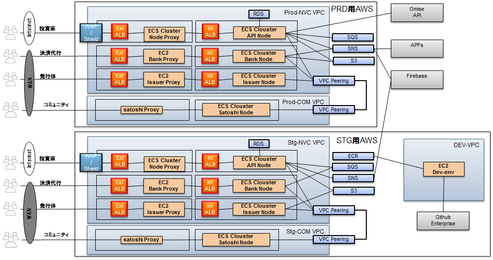

# Production用の定義とインストール、設定の仕方
## 1. 【全体構成】  

### 1.1. node-api
* ここに特徴など。
* メモメモ
### 1.2. satoshi
* ここに特徴など。
* メモメモ
### 1.3. issuer
* ここに特徴など。
* メモメモ
### 1.4. bank
* ここに特徴など。
* メモメモ

```
手順、コマンドを書く
```

